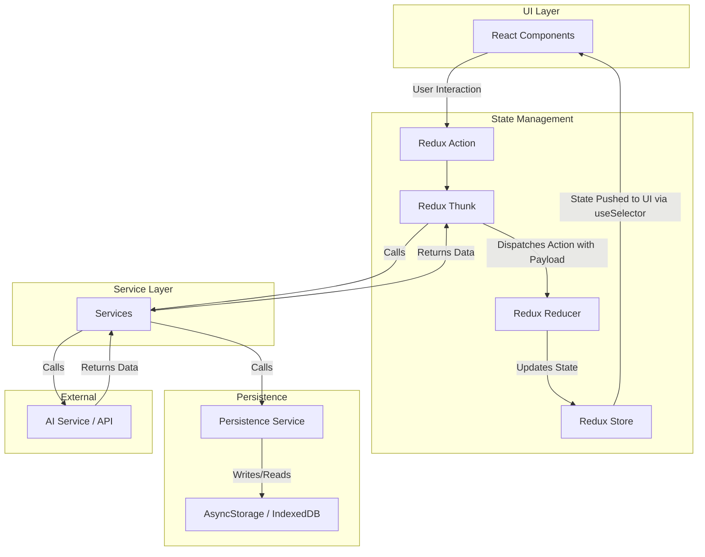
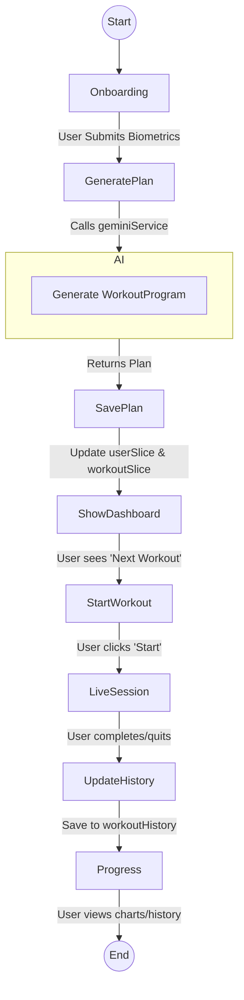

# 6. Data Flow and Models

This document outlines the primary data models, schemas, and data flow patterns within GymGenie.

## Core Data Models

Our primary data types are defined in [`types/index.ts`](../../types/index.ts) and validated using schemas from [`types/schemas.ts`](../../types/schemas.ts).

*   **`WorkoutProgram`**: The overall fitness plan generated by the AI. It contains a list of `WorkoutDay`s.
*   **`WorkoutDay`**: Represents a single day's workout, containing a list of `Exercise`s. It has a specific date.
*   **`Exercise`**: A specific movement to be performed, including its name, sets, reps, weight, and rest period.
*   **`WorkoutSession`**: A snapshot of the state of a live workout. It tracks the current exercise, set, and progress.
*   **`WorkoutHistory`**: A record of a completed workout, including the date, duration, and performance details for each exercise.

### Data Constraints & Invariants

*   **Sequential Workouts**: The system is designed to enforce a "no skipping days" rule. A user can only start a `WorkoutDay` if its scheduled date is today. This is validated by services like [`SessionSequenceValidator`](../../src/features/session/services/SessionSequenceValidator.ts).
*   **Immutable History**: Once a workout is completed and saved to `WorkoutHistory`, it should be treated as immutable.

## General Data Flow

The application follows a unidirectional data flow, which makes the state predictable and easier to debug.

**Flow Description:**

1.  **UI Interaction**: A user interacts with a React component (e.g., clicks "Start Workout").
2.  **Action Dispatch**: The component dispatches a Redux action, often a `thunk`.
3.  **Async Logic (Thunk)**: The thunk executes asynchronous logic. It calls one or more **Services** to perform tasks like fetching data from an API, generating a plan, or saving data.
4.  **Service Layer**: Services contain the core business logic. They might interact with external APIs (like `geminiService`), the persistence layer (`storageService`), or perform complex calculations.
5.  **Persistence**: The `storageService` handles reading from and writing to the device's local storage (AsyncStorage on mobile, localStorage/IndexedDB on web).
6.  **Update State**: Once the service returns data to the thunk, the thunk dispatches a final action with the data as its payload. A **Reducer** handles this action and updates the **Redux Store**.
7.  **UI Update**: The Redux store notifies the UI of the state change. Components subscribed to that piece of state (via `useSelector`) re-render with the new data.

## Onboarding & Plan Generation Flow

This diagram shows the user flow from first launch to starting their first workout.

